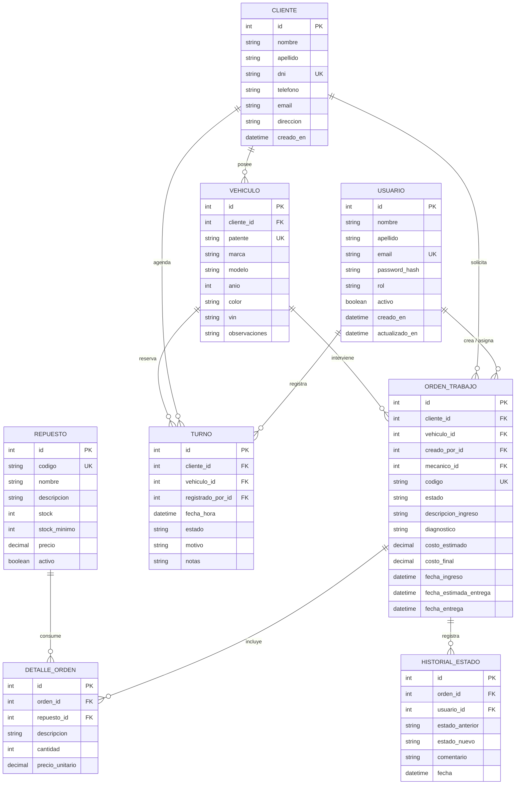

# Modelo Entidad-Relación (DER) — Boxly

**Proyecto:** Boxly – Sistema de Gestión de Taller Mecánico Automotriz  
**Sprint:** 1 · **Tarea:** BD-01  
**Responsable:** Antonio Chocobar  
**Versión:** 1.0 · **Fecha:** 09/2026

---

## 1. Alcance del modelo

El DER describe el dominio completo del taller. En el Sprint 1 se materializa en código la entidad **Usuario** (autenticación y roles). Las entidades **Cliente**, **Vehículo** y el resto se implementan en sprints siguientes (modelos/migraciones a cargo de Pablo Romano a partir de este diseño).

### Roles de sistema (Usuario)

| Rol | Descripción |
|-----|-------------|
| `administrador` | Gestión de usuarios, configuración y visión completa |
| `recepcion` | Clientes, vehículos, turnos y recepción de órdenes |
| `mecanico` | Órdenes asignadas, diagnóstico y avance de estados |

---

## 2. Diagrama entidad-relación

---

## 3. Entidades y atributos

### 3.1 Usuario

Personal interno del taller (login al sistema).

| Atributo | Tipo | Restricciones |
|----------|------|---------------|
| id | SERIAL / INT | PK |
| nombre | VARCHAR(80) | NOT NULL |
| apellido | VARCHAR(80) | NOT NULL |
| email | VARCHAR(120) | NOT NULL, UNIQUE |
| password_hash | VARCHAR(255) | NOT NULL |
| rol | VARCHAR(20) | NOT NULL · `administrador` \| `recepcion` \| `mecanico` |
| activo | BOOLEAN | NOT NULL, DEFAULT TRUE |
| creado_en | TIMESTAMP | NOT NULL, DEFAULT NOW() |
| actualizado_en | TIMESTAMP | NULL |

### 3.2 Cliente

Dueño de uno o más vehículos.

| Atributo | Tipo | Restricciones |
|----------|------|---------------|
| id | SERIAL | PK |
| nombre | VARCHAR(80) | NOT NULL |
| apellido | VARCHAR(80) | NOT NULL |
| dni | VARCHAR(20) | NOT NULL, UNIQUE |
| telefono | VARCHAR(30) | NULL |
| email | VARCHAR(120) | NULL |
| direccion | VARCHAR(200) | NULL |
| creado_en | TIMESTAMP | NOT NULL, DEFAULT NOW() |

### 3.3 Vehículo

| Atributo | Tipo | Restricciones |
|----------|------|---------------|
| id | SERIAL | PK |
| cliente_id | INT | FK → Cliente, NOT NULL |
| patente | VARCHAR(15) | NOT NULL, UNIQUE |
| marca | VARCHAR(60) | NOT NULL |
| modelo | VARCHAR(60) | NOT NULL |
| anio | INT | NULL |
| color | VARCHAR(40) | NULL |
| vin | VARCHAR(50) | NULL |
| observaciones | TEXT | NULL |

### 3.4 Orden de trabajo

Flujo de estados: `ingresado` → `en_diagnostico` → `esperando_repuestos` → `listo` → `entregado` (más `cancelado` si aplica).

| Atributo | Tipo | Restricciones |
|----------|------|---------------|
| id | SERIAL | PK |
| cliente_id | INT | FK → Cliente, NOT NULL |
| vehiculo_id | INT | FK → Vehículo, NOT NULL |
| creado_por_id | INT | FK → Usuario, NOT NULL |
| mecanico_id | INT | FK → Usuario, NULL |
| codigo | VARCHAR(30) | NOT NULL, UNIQUE |
| estado | VARCHAR(30) | NOT NULL |
| descripcion_ingreso | TEXT | NOT NULL |
| diagnostico | TEXT | NULL |
| costo_estimado | NUMERIC(12,2) | NULL |
| costo_final | NUMERIC(12,2) | NULL |
| fecha_ingreso | TIMESTAMP | NOT NULL |
| fecha_estimada_entrega | TIMESTAMP | NULL |
| fecha_entrega | TIMESTAMP | NULL |

### 3.5 Detalle de orden

Ítems de mano de obra o repuestos asociados a una orden.

| Atributo | Tipo | Restricciones |
|----------|------|---------------|
| id | SERIAL | PK |
| orden_id | INT | FK → OrdenTrabajo, NOT NULL |
| repuesto_id | INT | FK → Repuesto, NULL |
| descripcion | VARCHAR(200) | NOT NULL |
| cantidad | INT | NOT NULL, > 0 |
| precio_unitario | NUMERIC(12,2) | NOT NULL, ≥ 0 |

### 3.6 Repuesto (inventario)

| Atributo | Tipo | Restricciones |
|----------|------|---------------|
| id | SERIAL | PK |
| codigo | VARCHAR(40) | NOT NULL, UNIQUE |
| nombre | VARCHAR(120) | NOT NULL |
| descripcion | TEXT | NULL |
| stock | INT | NOT NULL, ≥ 0 |
| stock_minimo | INT | NOT NULL, ≥ 0 |
| precio | NUMERIC(12,2) | NOT NULL, ≥ 0 |
| activo | BOOLEAN | NOT NULL, DEFAULT TRUE |

### 3.7 Turno (agenda)

| Atributo | Tipo | Restricciones |
|----------|------|---------------|
| id | SERIAL | PK |
| cliente_id | INT | FK → Cliente, NOT NULL |
| vehiculo_id | INT | FK → Vehículo, NULL |
| registrado_por_id | INT | FK → Usuario, NOT NULL |
| fecha_hora | TIMESTAMP | NOT NULL |
| estado | VARCHAR(20) | `pendiente` \| `confirmado` \| `cancelado` \| `asistio` |
| motivo | VARCHAR(200) | NULL |
| notas | TEXT | NULL |

### 3.8 Historial de estado

Auditoría de cambios de estado en órdenes.

| Atributo | Tipo | Restricciones |
|----------|------|---------------|
| id | SERIAL | PK |
| orden_id | INT | FK → OrdenTrabajo, NOT NULL |
| usuario_id | INT | FK → Usuario, NOT NULL |
| estado_anterior | VARCHAR(30) | NULL |
| estado_nuevo | VARCHAR(30) | NOT NULL |
| comentario | TEXT | NULL |
| fecha | TIMESTAMP | NOT NULL, DEFAULT NOW() |

---

## 4. Cardinalidades

| Relación | Cardinalidad | Regla de negocio |
|----------|--------------|------------------|
| Cliente – Vehículo | 1:N | Un cliente puede tener varios vehículos; cada vehículo pertenece a un cliente. |
| Cliente – Orden | 1:N | Un cliente puede tener muchas órdenes. |
| Vehículo – Orden | 1:N | Un vehículo acumula historial de órdenes. |
| Usuario – Orden (creador) | 1:N | Quien registra la orden (recepción/admin). |
| Usuario – Orden (mecánico) | 1:N | Mecánico asignado (opcional al crear). |
| Orden – Detalle | 1:N | Líneas de trabajo/repuestos. |
| Repuesto – Detalle | 1:N | Un repuesto puede figurar en varios detalles. |
| Cliente / Vehículo – Turno | 1:N | Agenda de citas. |
| Orden – HistorialEstado | 1:N | Trazabilidad de cambios. |

---

## 5. Prioridad de implementación por sprint

| Sprint | Entidades a materializar |
|--------|--------------------------|
| **1** (actual) | Usuario (+ auth JWT) · DER documentado |
| **2** | Cliente, Vehículo, OrdenTrabajo (CRUD base) |
| **3+** | DetalleOrden, Repuesto, Turno, HistorialEstado |

---

## 6. Notas técnicas para implementación

- Motor: **PostgreSQL**.
- ORM previsto: **SQLAlchemy 2.x** + migraciones (Alembic) — tareas BD-02 / BD-03 (Pablo).
- Contraseñas: solo se persiste `password_hash` (bcrypt); nunca texto plano.
- Soft-delete opcional vía `activo` en Usuario y Repuesto; el resto puede usarse con borrado lógico en sprints posteriores.
- Índices recomendados: `usuario.email`, `cliente.dni`, `vehiculo.patente`, `orden.codigo`, `orden.estado`, `turno.fecha_hora`.
