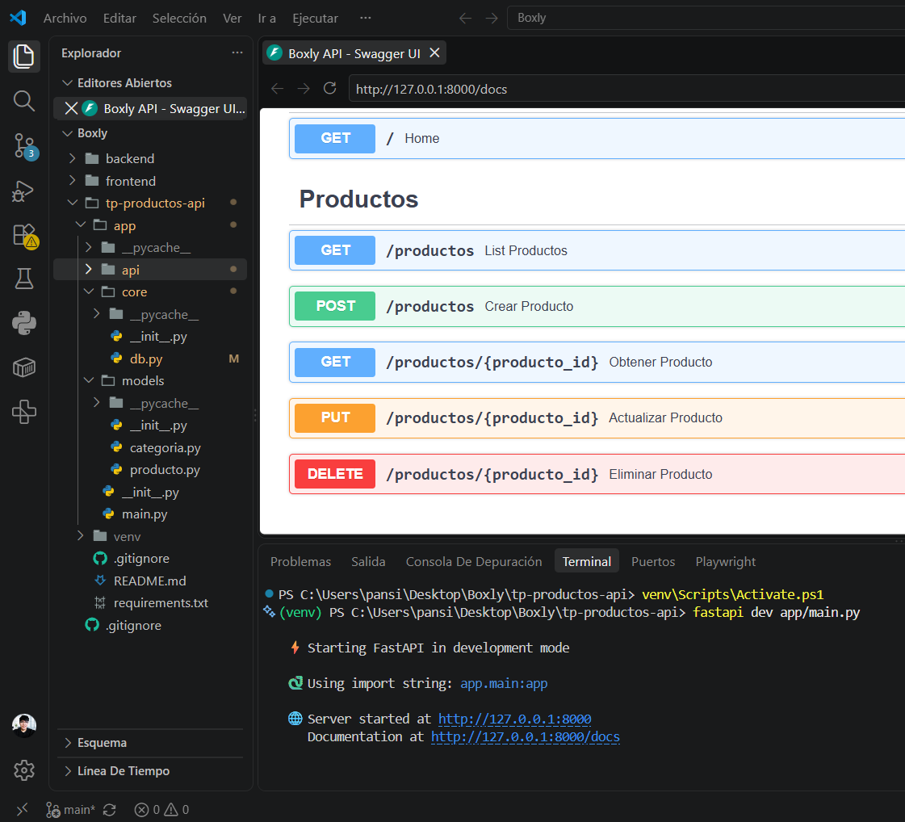
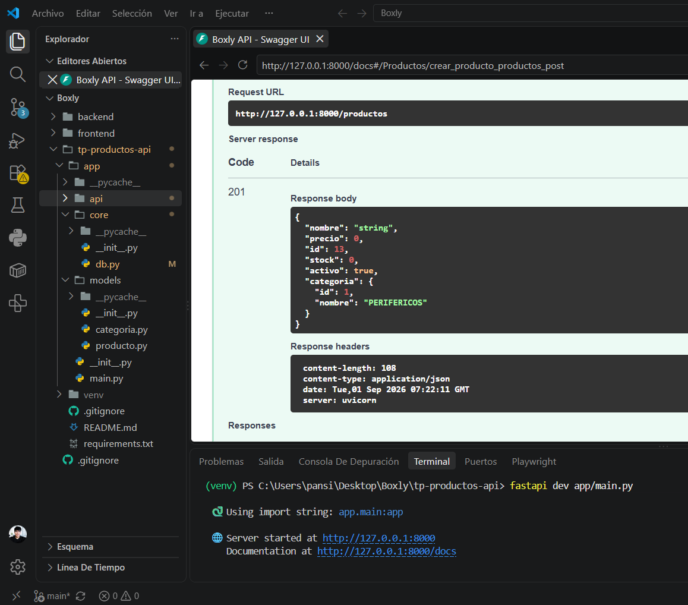
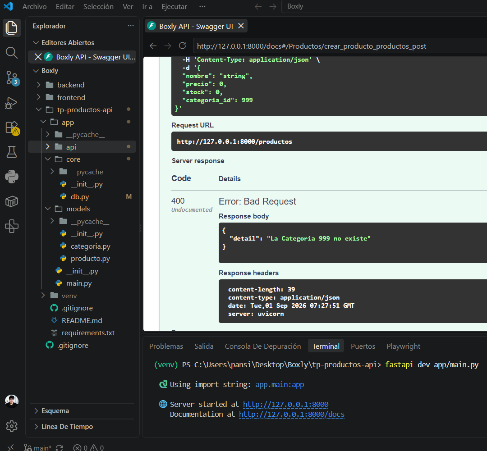
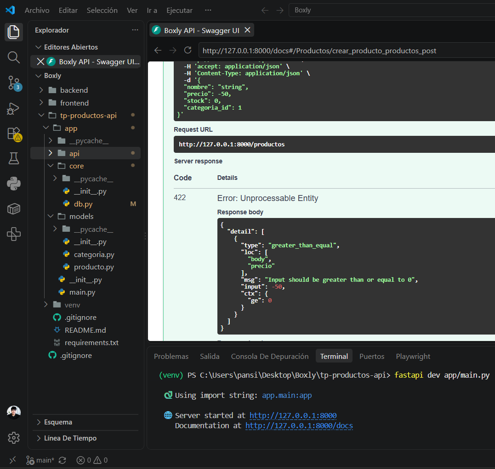
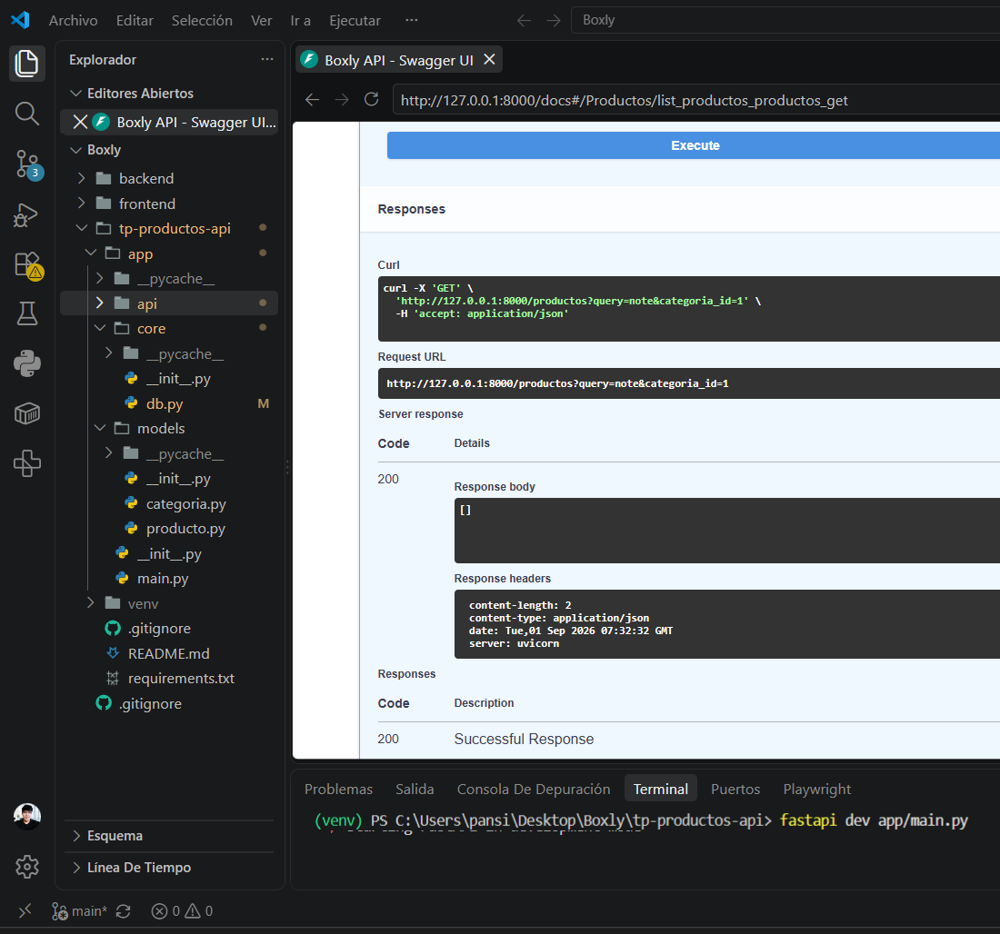
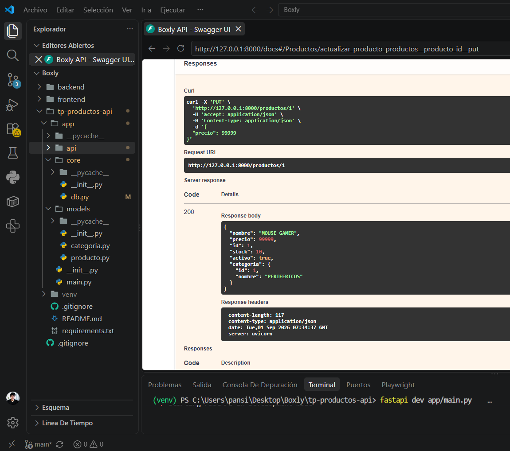
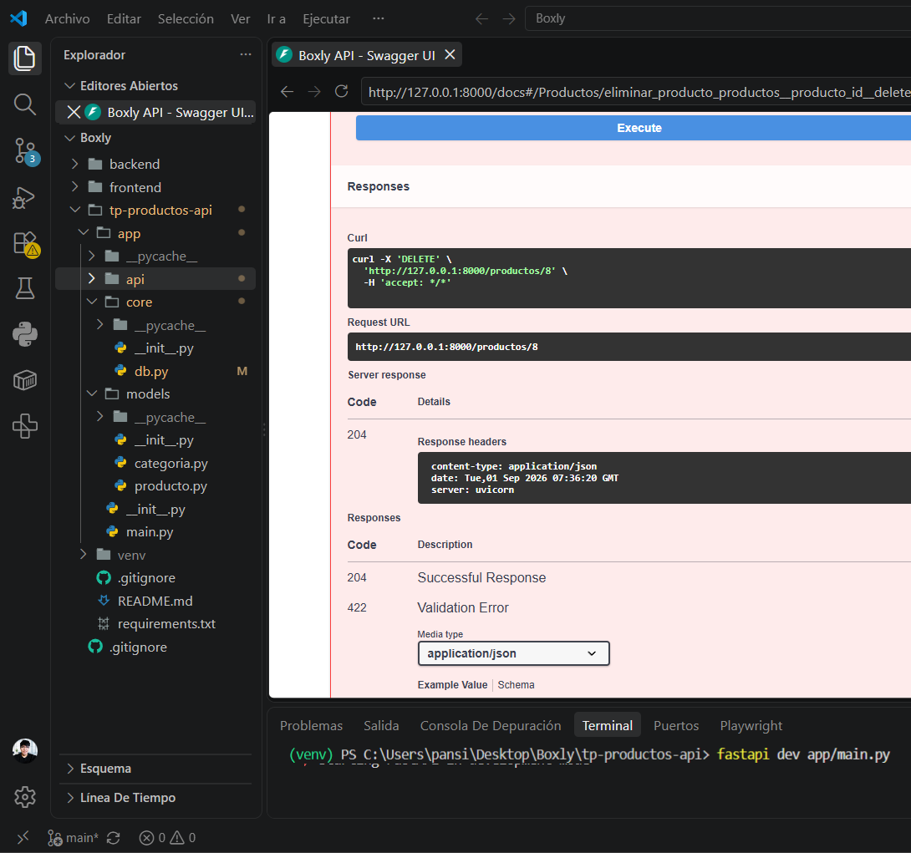
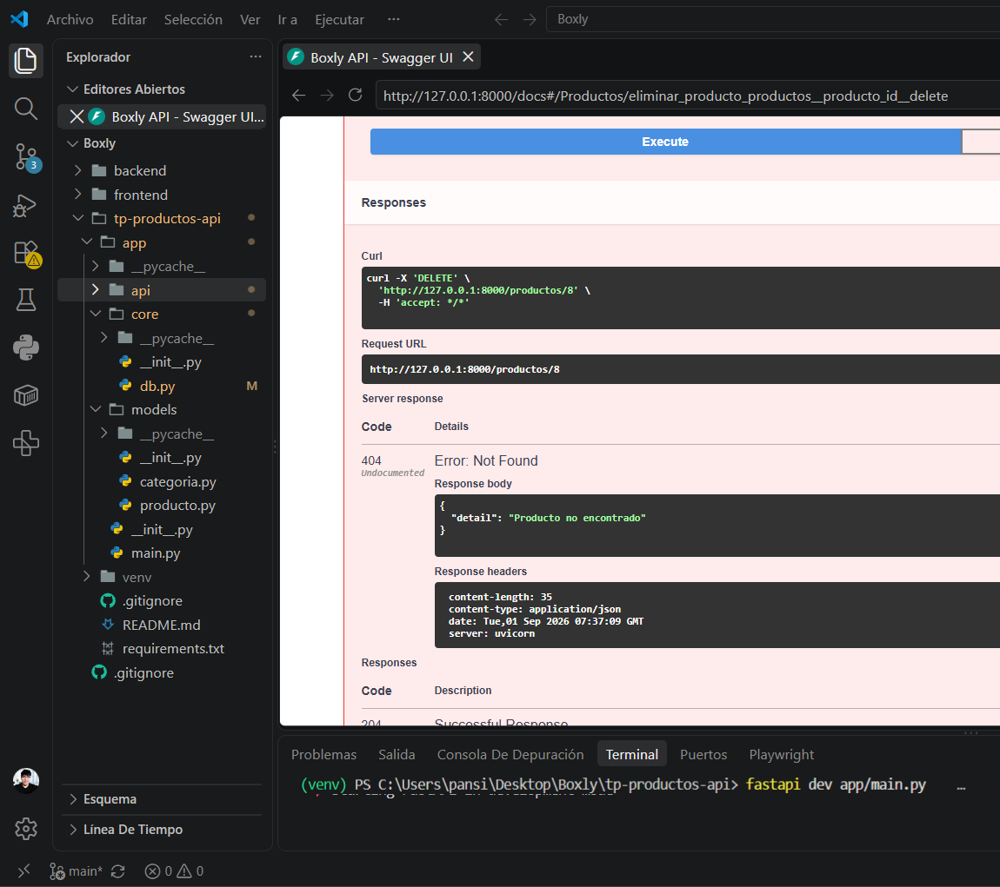
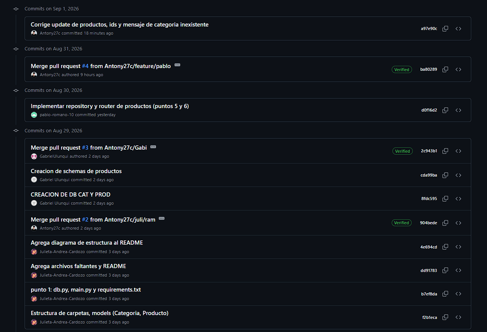

# API de Productos (FastAPI)

API REST de un catálogo de productos con arquitectura de capas (router / schemas / repository / models). La base de datos es una lista en memoria, con la misma estructura que se usaría luego con PostgreSQL.

Trabajo práctico — Prácticas Profesionalizantes II (Semanas 15-16).

## Integrantes

| Nombre | Usuario de GitHub |
|--------|-------------------|
| Antonio Chocobar | [Antony27c](https://github.com/Antony27c) |
| Julieta Andrea Cardozo | [Julieta-Andrea-Cardozo](https://github.com/Julieta-Andrea-Cardozo) |
| Gabriel Ulunqui | [GabrielUlunqui](https://github.com/GabrielUlunqui) |
| Pablo Romano | [pablo-romano-10](https://github.com/pablo-romano-10) |

## Estructura del proyecto
    tp-productos-api/
    ├── app/
    │   ├── __init__.py
    │   ├── main.py
    │   ├── core/
    │   │   ├── __init__.py
    │   │   └── db.py
    │   ├── models/
    │   │   ├── __init__.py
    │   │   ├── categoria.py
    │   │   └── producto.py
    │   └── api/
    │       ├── __init__.py
    │       └── v1/
    │           ├── __init__.py
    │           └── productos/
    │               ├── __init__.py
    │               ├── router.py
    │               ├── schemas.py
    │               └── repository.py
    ├── docs/
    ├── requirements.txt
    ├── README.md
    └── .gitignore

## Cómo ejecutar
    cd tp-productos-api
    python -m venv venv
    venv\Scripts\activate
    pip install -r requirements.txt
    fastapi dev app/main.py

Documentación Swagger: http://127.0.0.1:8000/docs

## Endpoints
| Método | Ruta | Descripción | Status |
|--------|------|-------------|--------|
| GET | `/` | Mensaje de bienvenida | 200 |
| GET | `/productos` | Listar todos | 200 |
| GET | `/productos?query=&categoria_id=` | Filtrar por nombre y/o categoría | 200 |
| GET | `/productos/{id}` | Obtener uno | 200 / 404 |
| POST | `/productos` | Crear | 201 / 400 / 422 |
| PUT | `/productos/{id}` | Actualizar (parcial) | 200 / 400 / 404 |
| DELETE | `/productos/{id}` | Eliminar | 204 / 404 |

- **400:** categoría inexistente (`La categoria X no existe`)
- **404:** producto no encontrado
- **422:** validación Pydantic (ej. `precio: -50`)

## Swagger UI (punto 7)

Endpoints agrupados bajo la tag **Productos**:

## Pruebas en Swagger UI (punto 8)

### a) Crear producto válido → 201

### b) Crear con categoria_id 999 → 400

### c) Crear con precio -50 → 422

### d) Listar filtrando query=note y categoria_id=1

### e) PUT solo el precio (exclude_unset) → 200

### f) DELETE → 204 y el mismo DELETE → 404

## Trabajo colaborativo (punto 9)

### Colaboradores del repositorio

### Historial de commits / Contributors

